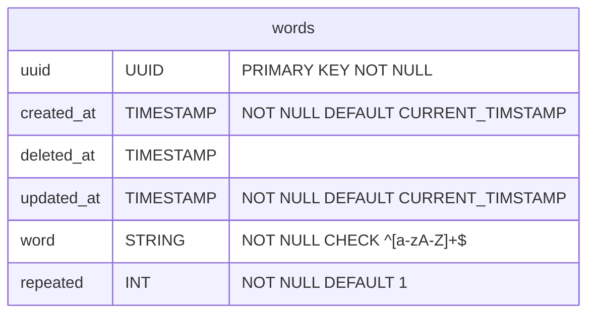

# Database 

This document describes the Entity relationship diagrams for the Database.

```mermaid
erDiagram

	words {
        uuid UUID "PRIMARY KEY NOT NULL"
        created_at TIMESTAMP "NOT NULL DEFAULT CURRENT_TIMSTAMP"
        deleted_at TIMESTAMP
        updated_at TIMESTAMP "NOT NULL DEFAULT CURRENT_TIMSTAMP"
        word STRING "NOT NULL CHECK ^[a-zA-Z]+$"
        repeated INT "NOT NULL DEFAULT 1"
	}
```

